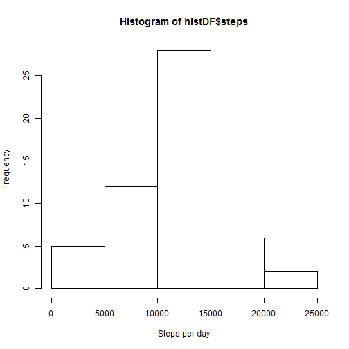
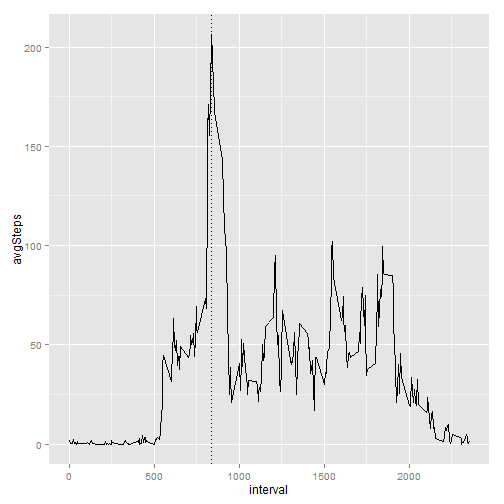
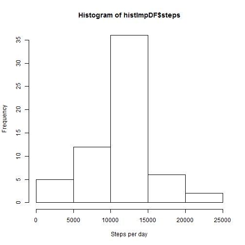
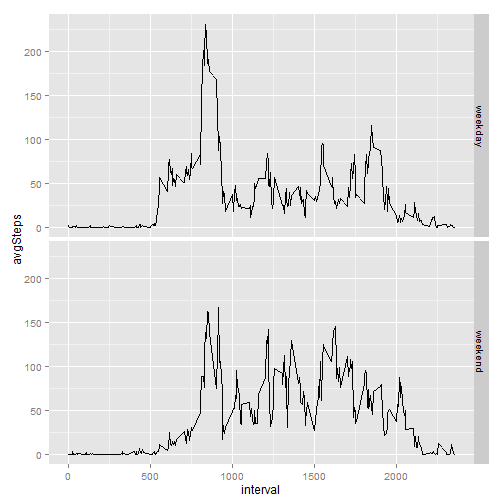

Loading the required packages for the data analysis


```r
require(dplyr)
require(knitr)
require(xtable)
require(ggplot2)
```


##Data
The data for this assignment can be downloaded from the course web site:
.Dataset: Activity monitoring data 

The variables included in this dataset are:

.steps: Number of steps taking in a 5-minute interval (missing values are coded as  NA )


.date: The date on which the measurement was taken in YYYY-MM-DD format


.interval: Identifier for the 5-minute interval in which measurement was taken


The dataset is stored in a comma-separated-value (CSV) file and there are a total of 17,568 observations in this dataset.

The first step is to read the data and then to clean the rows with NA values for first set of analysis.


```r
actDF <- read.csv("activity.csv", stringsAsFactors = FALSE)
actclDF <- filter(actDF,!is.na(steps)&!is.na(date)&!is.na(interval))
```

###Analysis Part 1 - What is mean total number of steps taken per day?

The histogram will display the total number of steps taken each day


```r
histDF <- actclDF %>% 
  group_by(date) %>%
  summarise(steps =sum(steps))

hist(histDF$steps, xlab="Steps per day")
```

 

The below presents the mean and median total number of steps taken per day


```r
statStepsDF <- actclDF %>% 
  group_by(date) %>%
  summarise(meanSteps =mean(steps), medianSteps = median(steps), totalSteps=sum(steps))

tab<- xtable(statStepsDF)
print(tab, type="html")
```

<!-- html table generated in R 3.1.3 by xtable 1.7-4 package -->
<!-- Sun Jul 19 01:17:08 2015 -->
<table border=1>
<tr> <th>  </th> <th> date </th> <th> meanSteps </th> <th> medianSteps </th> <th> totalSteps </th>  </tr>
  <tr> <td align="right"> 1 </td> <td> 2012-10-02 </td> <td align="right"> 0.44 </td> <td align="right"> 0.00 </td> <td align="right"> 126 </td> </tr>
  <tr> <td align="right"> 2 </td> <td> 2012-10-03 </td> <td align="right"> 39.42 </td> <td align="right"> 0.00 </td> <td align="right"> 11352 </td> </tr>
  <tr> <td align="right"> 3 </td> <td> 2012-10-04 </td> <td align="right"> 42.07 </td> <td align="right"> 0.00 </td> <td align="right"> 12116 </td> </tr>
  <tr> <td align="right"> 4 </td> <td> 2012-10-05 </td> <td align="right"> 46.16 </td> <td align="right"> 0.00 </td> <td align="right"> 13294 </td> </tr>
  <tr> <td align="right"> 5 </td> <td> 2012-10-06 </td> <td align="right"> 53.54 </td> <td align="right"> 0.00 </td> <td align="right"> 15420 </td> </tr>
  <tr> <td align="right"> 6 </td> <td> 2012-10-07 </td> <td align="right"> 38.25 </td> <td align="right"> 0.00 </td> <td align="right"> 11015 </td> </tr>
  <tr> <td align="right"> 7 </td> <td> 2012-10-09 </td> <td align="right"> 44.48 </td> <td align="right"> 0.00 </td> <td align="right"> 12811 </td> </tr>
  <tr> <td align="right"> 8 </td> <td> 2012-10-10 </td> <td align="right"> 34.38 </td> <td align="right"> 0.00 </td> <td align="right"> 9900 </td> </tr>
  <tr> <td align="right"> 9 </td> <td> 2012-10-11 </td> <td align="right"> 35.78 </td> <td align="right"> 0.00 </td> <td align="right"> 10304 </td> </tr>
  <tr> <td align="right"> 10 </td> <td> 2012-10-12 </td> <td align="right"> 60.35 </td> <td align="right"> 0.00 </td> <td align="right"> 17382 </td> </tr>
  <tr> <td align="right"> 11 </td> <td> 2012-10-13 </td> <td align="right"> 43.15 </td> <td align="right"> 0.00 </td> <td align="right"> 12426 </td> </tr>
  <tr> <td align="right"> 12 </td> <td> 2012-10-14 </td> <td align="right"> 52.42 </td> <td align="right"> 0.00 </td> <td align="right"> 15098 </td> </tr>
  <tr> <td align="right"> 13 </td> <td> 2012-10-15 </td> <td align="right"> 35.20 </td> <td align="right"> 0.00 </td> <td align="right"> 10139 </td> </tr>
  <tr> <td align="right"> 14 </td> <td> 2012-10-16 </td> <td align="right"> 52.38 </td> <td align="right"> 0.00 </td> <td align="right"> 15084 </td> </tr>
  <tr> <td align="right"> 15 </td> <td> 2012-10-17 </td> <td align="right"> 46.71 </td> <td align="right"> 0.00 </td> <td align="right"> 13452 </td> </tr>
  <tr> <td align="right"> 16 </td> <td> 2012-10-18 </td> <td align="right"> 34.92 </td> <td align="right"> 0.00 </td> <td align="right"> 10056 </td> </tr>
  <tr> <td align="right"> 17 </td> <td> 2012-10-19 </td> <td align="right"> 41.07 </td> <td align="right"> 0.00 </td> <td align="right"> 11829 </td> </tr>
  <tr> <td align="right"> 18 </td> <td> 2012-10-20 </td> <td align="right"> 36.09 </td> <td align="right"> 0.00 </td> <td align="right"> 10395 </td> </tr>
  <tr> <td align="right"> 19 </td> <td> 2012-10-21 </td> <td align="right"> 30.63 </td> <td align="right"> 0.00 </td> <td align="right"> 8821 </td> </tr>
  <tr> <td align="right"> 20 </td> <td> 2012-10-22 </td> <td align="right"> 46.74 </td> <td align="right"> 0.00 </td> <td align="right"> 13460 </td> </tr>
  <tr> <td align="right"> 21 </td> <td> 2012-10-23 </td> <td align="right"> 30.97 </td> <td align="right"> 0.00 </td> <td align="right"> 8918 </td> </tr>
  <tr> <td align="right"> 22 </td> <td> 2012-10-24 </td> <td align="right"> 29.01 </td> <td align="right"> 0.00 </td> <td align="right"> 8355 </td> </tr>
  <tr> <td align="right"> 23 </td> <td> 2012-10-25 </td> <td align="right"> 8.65 </td> <td align="right"> 0.00 </td> <td align="right"> 2492 </td> </tr>
  <tr> <td align="right"> 24 </td> <td> 2012-10-26 </td> <td align="right"> 23.53 </td> <td align="right"> 0.00 </td> <td align="right"> 6778 </td> </tr>
  <tr> <td align="right"> 25 </td> <td> 2012-10-27 </td> <td align="right"> 35.14 </td> <td align="right"> 0.00 </td> <td align="right"> 10119 </td> </tr>
  <tr> <td align="right"> 26 </td> <td> 2012-10-28 </td> <td align="right"> 39.78 </td> <td align="right"> 0.00 </td> <td align="right"> 11458 </td> </tr>
  <tr> <td align="right"> 27 </td> <td> 2012-10-29 </td> <td align="right"> 17.42 </td> <td align="right"> 0.00 </td> <td align="right"> 5018 </td> </tr>
  <tr> <td align="right"> 28 </td> <td> 2012-10-30 </td> <td align="right"> 34.09 </td> <td align="right"> 0.00 </td> <td align="right"> 9819 </td> </tr>
  <tr> <td align="right"> 29 </td> <td> 2012-10-31 </td> <td align="right"> 53.52 </td> <td align="right"> 0.00 </td> <td align="right"> 15414 </td> </tr>
  <tr> <td align="right"> 30 </td> <td> 2012-11-02 </td> <td align="right"> 36.81 </td> <td align="right"> 0.00 </td> <td align="right"> 10600 </td> </tr>
  <tr> <td align="right"> 31 </td> <td> 2012-11-03 </td> <td align="right"> 36.70 </td> <td align="right"> 0.00 </td> <td align="right"> 10571 </td> </tr>
  <tr> <td align="right"> 32 </td> <td> 2012-11-05 </td> <td align="right"> 36.25 </td> <td align="right"> 0.00 </td> <td align="right"> 10439 </td> </tr>
  <tr> <td align="right"> 33 </td> <td> 2012-11-06 </td> <td align="right"> 28.94 </td> <td align="right"> 0.00 </td> <td align="right"> 8334 </td> </tr>
  <tr> <td align="right"> 34 </td> <td> 2012-11-07 </td> <td align="right"> 44.73 </td> <td align="right"> 0.00 </td> <td align="right"> 12883 </td> </tr>
  <tr> <td align="right"> 35 </td> <td> 2012-11-08 </td> <td align="right"> 11.18 </td> <td align="right"> 0.00 </td> <td align="right"> 3219 </td> </tr>
  <tr> <td align="right"> 36 </td> <td> 2012-11-11 </td> <td align="right"> 43.78 </td> <td align="right"> 0.00 </td> <td align="right"> 12608 </td> </tr>
  <tr> <td align="right"> 37 </td> <td> 2012-11-12 </td> <td align="right"> 37.38 </td> <td align="right"> 0.00 </td> <td align="right"> 10765 </td> </tr>
  <tr> <td align="right"> 38 </td> <td> 2012-11-13 </td> <td align="right"> 25.47 </td> <td align="right"> 0.00 </td> <td align="right"> 7336 </td> </tr>
  <tr> <td align="right"> 39 </td> <td> 2012-11-15 </td> <td align="right"> 0.14 </td> <td align="right"> 0.00 </td> <td align="right">  41 </td> </tr>
  <tr> <td align="right"> 40 </td> <td> 2012-11-16 </td> <td align="right"> 18.89 </td> <td align="right"> 0.00 </td> <td align="right"> 5441 </td> </tr>
  <tr> <td align="right"> 41 </td> <td> 2012-11-17 </td> <td align="right"> 49.79 </td> <td align="right"> 0.00 </td> <td align="right"> 14339 </td> </tr>
  <tr> <td align="right"> 42 </td> <td> 2012-11-18 </td> <td align="right"> 52.47 </td> <td align="right"> 0.00 </td> <td align="right"> 15110 </td> </tr>
  <tr> <td align="right"> 43 </td> <td> 2012-11-19 </td> <td align="right"> 30.70 </td> <td align="right"> 0.00 </td> <td align="right"> 8841 </td> </tr>
  <tr> <td align="right"> 44 </td> <td> 2012-11-20 </td> <td align="right"> 15.53 </td> <td align="right"> 0.00 </td> <td align="right"> 4472 </td> </tr>
  <tr> <td align="right"> 45 </td> <td> 2012-11-21 </td> <td align="right"> 44.40 </td> <td align="right"> 0.00 </td> <td align="right"> 12787 </td> </tr>
  <tr> <td align="right"> 46 </td> <td> 2012-11-22 </td> <td align="right"> 70.93 </td> <td align="right"> 0.00 </td> <td align="right"> 20427 </td> </tr>
  <tr> <td align="right"> 47 </td> <td> 2012-11-23 </td> <td align="right"> 73.59 </td> <td align="right"> 0.00 </td> <td align="right"> 21194 </td> </tr>
  <tr> <td align="right"> 48 </td> <td> 2012-11-24 </td> <td align="right"> 50.27 </td> <td align="right"> 0.00 </td> <td align="right"> 14478 </td> </tr>
  <tr> <td align="right"> 49 </td> <td> 2012-11-25 </td> <td align="right"> 41.09 </td> <td align="right"> 0.00 </td> <td align="right"> 11834 </td> </tr>
  <tr> <td align="right"> 50 </td> <td> 2012-11-26 </td> <td align="right"> 38.76 </td> <td align="right"> 0.00 </td> <td align="right"> 11162 </td> </tr>
  <tr> <td align="right"> 51 </td> <td> 2012-11-27 </td> <td align="right"> 47.38 </td> <td align="right"> 0.00 </td> <td align="right"> 13646 </td> </tr>
  <tr> <td align="right"> 52 </td> <td> 2012-11-28 </td> <td align="right"> 35.36 </td> <td align="right"> 0.00 </td> <td align="right"> 10183 </td> </tr>
  <tr> <td align="right"> 53 </td> <td> 2012-11-29 </td> <td align="right"> 24.47 </td> <td align="right"> 0.00 </td> <td align="right"> 7047 </td> </tr>
   </table>

###Analysis Part 2 - What is the average daily activity pattern?

The below time series plot  displays 5-minute interval on x-axis and the average number of steps taken, averaged across all days on y-axis


```r
intStepsDF <- actclDF %>% 
  group_by(interval) %>%
  summarise(avgSteps =mean(steps))

g <- ggplot(data=intStepsDF, aes(x=interval,y=avgSteps))+
  geom_line()

maxAvgStepInt <- filter(intStepsDF,avgSteps==max(avgSteps))$interval

g+geom_vline(xintercept=maxAvgStepInt, linetype="dotted")
```

 

The 835th 5-minute interval, on average across all the days in the dataset, contains the maximum number of steps.

###Analysis Part 3 - Imputing missing values

There are a number of days/intervals where there are missing values (coded as  NA ). The presence of missing days may introduce bias into some calculations or summaries of the data.

1st step is to calculate report the total number of missing values in the dataset (i.e. the total number of rows with  NA s)


```r
numNA <- nrow(filter(actDF,is.na(steps)))
```

There are 2304 rows with NA s.

Next step  is to filling in all of the missing values in the dataset with mean for that 5-minute interval.


```r
actImpDF<-actDF
for(i in 1:nrow(actImpDF))
  {
    if (is.na(actImpDF[i,"steps"]))
    {
      actImpDF[i,"steps"] <- round(filter(intStepsDF,interval==actImpDF[i,"interval"])$avgSteps)
    }
  }
```


The below histogram displays the total number of steps taken each day after imputing missing data.


```r
histImpDF <- actImpDF %>% 
  group_by(date) %>%
  summarise(steps =sum(steps))

hist(histImpDF$steps, xlab="Steps per day")
```

 


The below table report the mean and median total number of steps taken per day after imputing missing data.


```r
statImpStepsDF <- actImpDF %>% 
  group_by(date) %>%
  summarise(meanSteps =mean(steps), medianSteps = median(steps), totalSteps=sum(steps))

tab<- xtable(statImpStepsDF)
print(tab, type="html")
```

<!-- html table generated in R 3.1.3 by xtable 1.7-4 package -->
<!-- Sun Jul 19 01:17:10 2015 -->
<table border=1>
<tr> <th>  </th> <th> date </th> <th> meanSteps </th> <th> medianSteps </th> <th> totalSteps </th>  </tr>
  <tr> <td align="right"> 1 </td> <td> 2012-10-01 </td> <td align="right"> 37.37 </td> <td align="right"> 34.50 </td> <td align="right"> 10762.00 </td> </tr>
  <tr> <td align="right"> 2 </td> <td> 2012-10-02 </td> <td align="right"> 0.44 </td> <td align="right"> 0.00 </td> <td align="right"> 126.00 </td> </tr>
  <tr> <td align="right"> 3 </td> <td> 2012-10-03 </td> <td align="right"> 39.42 </td> <td align="right"> 0.00 </td> <td align="right"> 11352.00 </td> </tr>
  <tr> <td align="right"> 4 </td> <td> 2012-10-04 </td> <td align="right"> 42.07 </td> <td align="right"> 0.00 </td> <td align="right"> 12116.00 </td> </tr>
  <tr> <td align="right"> 5 </td> <td> 2012-10-05 </td> <td align="right"> 46.16 </td> <td align="right"> 0.00 </td> <td align="right"> 13294.00 </td> </tr>
  <tr> <td align="right"> 6 </td> <td> 2012-10-06 </td> <td align="right"> 53.54 </td> <td align="right"> 0.00 </td> <td align="right"> 15420.00 </td> </tr>
  <tr> <td align="right"> 7 </td> <td> 2012-10-07 </td> <td align="right"> 38.25 </td> <td align="right"> 0.00 </td> <td align="right"> 11015.00 </td> </tr>
  <tr> <td align="right"> 8 </td> <td> 2012-10-08 </td> <td align="right"> 37.37 </td> <td align="right"> 34.50 </td> <td align="right"> 10762.00 </td> </tr>
  <tr> <td align="right"> 9 </td> <td> 2012-10-09 </td> <td align="right"> 44.48 </td> <td align="right"> 0.00 </td> <td align="right"> 12811.00 </td> </tr>
  <tr> <td align="right"> 10 </td> <td> 2012-10-10 </td> <td align="right"> 34.38 </td> <td align="right"> 0.00 </td> <td align="right"> 9900.00 </td> </tr>
  <tr> <td align="right"> 11 </td> <td> 2012-10-11 </td> <td align="right"> 35.78 </td> <td align="right"> 0.00 </td> <td align="right"> 10304.00 </td> </tr>
  <tr> <td align="right"> 12 </td> <td> 2012-10-12 </td> <td align="right"> 60.35 </td> <td align="right"> 0.00 </td> <td align="right"> 17382.00 </td> </tr>
  <tr> <td align="right"> 13 </td> <td> 2012-10-13 </td> <td align="right"> 43.15 </td> <td align="right"> 0.00 </td> <td align="right"> 12426.00 </td> </tr>
  <tr> <td align="right"> 14 </td> <td> 2012-10-14 </td> <td align="right"> 52.42 </td> <td align="right"> 0.00 </td> <td align="right"> 15098.00 </td> </tr>
  <tr> <td align="right"> 15 </td> <td> 2012-10-15 </td> <td align="right"> 35.20 </td> <td align="right"> 0.00 </td> <td align="right"> 10139.00 </td> </tr>
  <tr> <td align="right"> 16 </td> <td> 2012-10-16 </td> <td align="right"> 52.38 </td> <td align="right"> 0.00 </td> <td align="right"> 15084.00 </td> </tr>
  <tr> <td align="right"> 17 </td> <td> 2012-10-17 </td> <td align="right"> 46.71 </td> <td align="right"> 0.00 </td> <td align="right"> 13452.00 </td> </tr>
  <tr> <td align="right"> 18 </td> <td> 2012-10-18 </td> <td align="right"> 34.92 </td> <td align="right"> 0.00 </td> <td align="right"> 10056.00 </td> </tr>
  <tr> <td align="right"> 19 </td> <td> 2012-10-19 </td> <td align="right"> 41.07 </td> <td align="right"> 0.00 </td> <td align="right"> 11829.00 </td> </tr>
  <tr> <td align="right"> 20 </td> <td> 2012-10-20 </td> <td align="right"> 36.09 </td> <td align="right"> 0.00 </td> <td align="right"> 10395.00 </td> </tr>
  <tr> <td align="right"> 21 </td> <td> 2012-10-21 </td> <td align="right"> 30.63 </td> <td align="right"> 0.00 </td> <td align="right"> 8821.00 </td> </tr>
  <tr> <td align="right"> 22 </td> <td> 2012-10-22 </td> <td align="right"> 46.74 </td> <td align="right"> 0.00 </td> <td align="right"> 13460.00 </td> </tr>
  <tr> <td align="right"> 23 </td> <td> 2012-10-23 </td> <td align="right"> 30.97 </td> <td align="right"> 0.00 </td> <td align="right"> 8918.00 </td> </tr>
  <tr> <td align="right"> 24 </td> <td> 2012-10-24 </td> <td align="right"> 29.01 </td> <td align="right"> 0.00 </td> <td align="right"> 8355.00 </td> </tr>
  <tr> <td align="right"> 25 </td> <td> 2012-10-25 </td> <td align="right"> 8.65 </td> <td align="right"> 0.00 </td> <td align="right"> 2492.00 </td> </tr>
  <tr> <td align="right"> 26 </td> <td> 2012-10-26 </td> <td align="right"> 23.53 </td> <td align="right"> 0.00 </td> <td align="right"> 6778.00 </td> </tr>
  <tr> <td align="right"> 27 </td> <td> 2012-10-27 </td> <td align="right"> 35.14 </td> <td align="right"> 0.00 </td> <td align="right"> 10119.00 </td> </tr>
  <tr> <td align="right"> 28 </td> <td> 2012-10-28 </td> <td align="right"> 39.78 </td> <td align="right"> 0.00 </td> <td align="right"> 11458.00 </td> </tr>
  <tr> <td align="right"> 29 </td> <td> 2012-10-29 </td> <td align="right"> 17.42 </td> <td align="right"> 0.00 </td> <td align="right"> 5018.00 </td> </tr>
  <tr> <td align="right"> 30 </td> <td> 2012-10-30 </td> <td align="right"> 34.09 </td> <td align="right"> 0.00 </td> <td align="right"> 9819.00 </td> </tr>
  <tr> <td align="right"> 31 </td> <td> 2012-10-31 </td> <td align="right"> 53.52 </td> <td align="right"> 0.00 </td> <td align="right"> 15414.00 </td> </tr>
  <tr> <td align="right"> 32 </td> <td> 2012-11-01 </td> <td align="right"> 37.37 </td> <td align="right"> 34.50 </td> <td align="right"> 10762.00 </td> </tr>
  <tr> <td align="right"> 33 </td> <td> 2012-11-02 </td> <td align="right"> 36.81 </td> <td align="right"> 0.00 </td> <td align="right"> 10600.00 </td> </tr>
  <tr> <td align="right"> 34 </td> <td> 2012-11-03 </td> <td align="right"> 36.70 </td> <td align="right"> 0.00 </td> <td align="right"> 10571.00 </td> </tr>
  <tr> <td align="right"> 35 </td> <td> 2012-11-04 </td> <td align="right"> 37.37 </td> <td align="right"> 34.50 </td> <td align="right"> 10762.00 </td> </tr>
  <tr> <td align="right"> 36 </td> <td> 2012-11-05 </td> <td align="right"> 36.25 </td> <td align="right"> 0.00 </td> <td align="right"> 10439.00 </td> </tr>
  <tr> <td align="right"> 37 </td> <td> 2012-11-06 </td> <td align="right"> 28.94 </td> <td align="right"> 0.00 </td> <td align="right"> 8334.00 </td> </tr>
  <tr> <td align="right"> 38 </td> <td> 2012-11-07 </td> <td align="right"> 44.73 </td> <td align="right"> 0.00 </td> <td align="right"> 12883.00 </td> </tr>
  <tr> <td align="right"> 39 </td> <td> 2012-11-08 </td> <td align="right"> 11.18 </td> <td align="right"> 0.00 </td> <td align="right"> 3219.00 </td> </tr>
  <tr> <td align="right"> 40 </td> <td> 2012-11-09 </td> <td align="right"> 37.37 </td> <td align="right"> 34.50 </td> <td align="right"> 10762.00 </td> </tr>
  <tr> <td align="right"> 41 </td> <td> 2012-11-10 </td> <td align="right"> 37.37 </td> <td align="right"> 34.50 </td> <td align="right"> 10762.00 </td> </tr>
  <tr> <td align="right"> 42 </td> <td> 2012-11-11 </td> <td align="right"> 43.78 </td> <td align="right"> 0.00 </td> <td align="right"> 12608.00 </td> </tr>
  <tr> <td align="right"> 43 </td> <td> 2012-11-12 </td> <td align="right"> 37.38 </td> <td align="right"> 0.00 </td> <td align="right"> 10765.00 </td> </tr>
  <tr> <td align="right"> 44 </td> <td> 2012-11-13 </td> <td align="right"> 25.47 </td> <td align="right"> 0.00 </td> <td align="right"> 7336.00 </td> </tr>
  <tr> <td align="right"> 45 </td> <td> 2012-11-14 </td> <td align="right"> 37.37 </td> <td align="right"> 34.50 </td> <td align="right"> 10762.00 </td> </tr>
  <tr> <td align="right"> 46 </td> <td> 2012-11-15 </td> <td align="right"> 0.14 </td> <td align="right"> 0.00 </td> <td align="right"> 41.00 </td> </tr>
  <tr> <td align="right"> 47 </td> <td> 2012-11-16 </td> <td align="right"> 18.89 </td> <td align="right"> 0.00 </td> <td align="right"> 5441.00 </td> </tr>
  <tr> <td align="right"> 48 </td> <td> 2012-11-17 </td> <td align="right"> 49.79 </td> <td align="right"> 0.00 </td> <td align="right"> 14339.00 </td> </tr>
  <tr> <td align="right"> 49 </td> <td> 2012-11-18 </td> <td align="right"> 52.47 </td> <td align="right"> 0.00 </td> <td align="right"> 15110.00 </td> </tr>
  <tr> <td align="right"> 50 </td> <td> 2012-11-19 </td> <td align="right"> 30.70 </td> <td align="right"> 0.00 </td> <td align="right"> 8841.00 </td> </tr>
  <tr> <td align="right"> 51 </td> <td> 2012-11-20 </td> <td align="right"> 15.53 </td> <td align="right"> 0.00 </td> <td align="right"> 4472.00 </td> </tr>
  <tr> <td align="right"> 52 </td> <td> 2012-11-21 </td> <td align="right"> 44.40 </td> <td align="right"> 0.00 </td> <td align="right"> 12787.00 </td> </tr>
  <tr> <td align="right"> 53 </td> <td> 2012-11-22 </td> <td align="right"> 70.93 </td> <td align="right"> 0.00 </td> <td align="right"> 20427.00 </td> </tr>
  <tr> <td align="right"> 54 </td> <td> 2012-11-23 </td> <td align="right"> 73.59 </td> <td align="right"> 0.00 </td> <td align="right"> 21194.00 </td> </tr>
  <tr> <td align="right"> 55 </td> <td> 2012-11-24 </td> <td align="right"> 50.27 </td> <td align="right"> 0.00 </td> <td align="right"> 14478.00 </td> </tr>
  <tr> <td align="right"> 56 </td> <td> 2012-11-25 </td> <td align="right"> 41.09 </td> <td align="right"> 0.00 </td> <td align="right"> 11834.00 </td> </tr>
  <tr> <td align="right"> 57 </td> <td> 2012-11-26 </td> <td align="right"> 38.76 </td> <td align="right"> 0.00 </td> <td align="right"> 11162.00 </td> </tr>
  <tr> <td align="right"> 58 </td> <td> 2012-11-27 </td> <td align="right"> 47.38 </td> <td align="right"> 0.00 </td> <td align="right"> 13646.00 </td> </tr>
  <tr> <td align="right"> 59 </td> <td> 2012-11-28 </td> <td align="right"> 35.36 </td> <td align="right"> 0.00 </td> <td align="right"> 10183.00 </td> </tr>
  <tr> <td align="right"> 60 </td> <td> 2012-11-29 </td> <td align="right"> 24.47 </td> <td align="right"> 0.00 </td> <td align="right"> 7047.00 </td> </tr>
  <tr> <td align="right"> 61 </td> <td> 2012-11-30 </td> <td align="right"> 37.37 </td> <td align="right"> 34.50 </td> <td align="right"> 10762.00 </td> </tr>
   </table>

###Analysis Part 4 - Are there differences in activity patterns between weekdays and weekends?

1st step is to create a new factor variable in the dataset with two levels - "weekday" and "weekend" indicating whether a given date is a weekday or weekend day.


```r
wday <- function(y)
         {
            x<-""
            if((weekdays(as.Date(y))=="Saturday") | (weekdays(as.Date(y))== "Sunday"))
             {
                x<-"weekend"
             }
           else
             {
               x<-"weekday"
             }
           x
         }
                    

day <- data.frame(sapply(actImpDF$date,wday))
actImpWDDF <- cbind(actImpDF,day)
names(actImpWDDF)[4]<-paste("wday") 

intWDStepsDF <- actImpWDDF %>% 
  group_by(interval,wday) %>%
  summarise(avgSteps =mean(steps))
```

The below panel plot shows a time series plot of the 5-minute interval on x-axi and the average number of steps taken, averaged across all weekday days or weekend days on y-axis.


```r
ggplot(data=intWDStepsDF, aes(x=interval,y=avgSteps))+
  geom_line()+facet_grid(wday~.)
```

 
